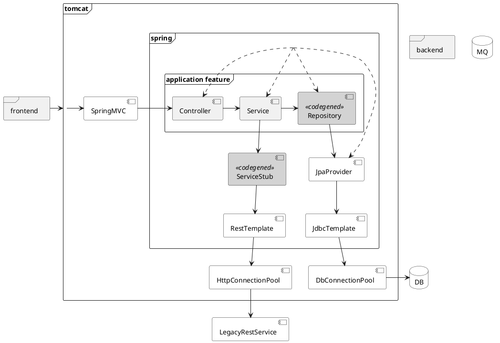

Тренинг «Unit Testing & TDD Advanced»
=====================================
18 ак. ч, 24 астр. ч.

Цели тренинга
=============
После тренинга участники смогут:
--------------------------------
- [ ] Обеспечить переход к (A)TDD в команде
- [ ] Сохранять качества дизайна и архитектуры при использовании (A)TDD
- [ ] Развивать через (A)TDD data driven applications на Spring, использующие БД и очереди 
- [ ] Развивать через (A)TDD интеграционные приложения на Spring, использующие внешние SOAP/REST-сервисы 
- [ ] Оптимизировать выполнение тестов для Spring-приложений
- [ ] Повысить надежность тестов многопоточного кода
- [ ] Повысить надежность тестов date/time-зависимого кода

Ожидания от участников на входе
-------------------------------
- [ ] Понимание автотестирования и практики TDD в объеме тренинга [Unit Testing and TDD](https://github.com/eugene-krivosheyev/unit-testing-and-tdd)

Пререквизиты
============
### Hardware
- [ ] RAM ≥ 8Гб

### Software
- [ ] [git client](https://git-scm.com/download/win)
- [ ] [JDK8](https://adoptopenjdk.net/)
- [ ] [IDEA Ultimate](https://www.jetbrains.com/idea/download) (можно trial)
- [ ] [Gradle](https://gradle.org/install/)
- [ ] [Docker](https://docs.docker.com/desktop/)
- [ ] [JMeter](https://jmeter.apache.org/download_jmeter.cgi)  
- [x] [Chrome](https://www.google.com/intl/ru/chrome/)

### Доступы
- [ ] https://github.com:443 (с возможностью логина, pull и push)
- [ ] https://mvnrepository.com:443
- [ ] https://repo.maven.apache.org:443

Программа
=========
Зачем мы собрались? (0.5 часа всего / _из них_ 0 часов практики)
---------------------------------------------------------------
- [ ] Обзор тренинга
- [ ] О тренере
- [ ] Разбивка по парам и знакомство-представление друг друга
- [ ] Приоритезация целей тренинга и сбор проблем
- [ ] Сделаны форки [проекта с тренингом](https://github.com/eugene-krivosheyev/unit-testing-and-tdd-advanced) и [проекта с приложением](https://github.com/eugene-krivosheyev/agile-practices-application) в личные проекты 
- [ ] Cклонированы форкнутые личные проекты
```
git clone --depth 1 -b master https://github.com/ACCOUNT/agile-practices-application
git clone --depth 1 -b master https://github.com/ACCOUNT/unit-testing-and-tdd-advanced
```
- [ ] Sound check
```
cd agile-practices-application
mvn clean verify -DexcludedGroups="selenium"
gradle clean check bootJar jacocoTestReport pitest -i --scan --no-build-cache -DexcludedGroups="selenium"
```

Выравнивание понимания (A)TDD (1/1)
-----------------------------
- [ ] Given pairs
- [ ] When pairs align answers:
1. What is [TDD](https://github.com/eugene-krivosheyev/unit-testing-and-tdd#какую-ценность-дает-практика-tdd-050)?
1. What is [rhythm/mantra for TDD cycle](https://github.com/eugene-krivosheyev/unit-testing-and-tdd#в-каком-ритме-писать-по-tdd-1505)?
1. What are [Test-Driven Development Patterns](https://github.com/eugene-krivosheyev/unit-testing-and-tdd#базовые-шаблоны-tdd-151)?
1. What are Red Bar Patterns?
1. What are Testing Patterns?
1. What are Green Bar Patterns?
1. What are the most important patterns of TDD, as you think?
1. What is ATDD?
1. What is the architecture mapping between Acceptance and Unit tests? 
- [ ] Then group aligns answers

Что дают практики TDD и ATDD? (2/1)
-----------------------------
- [ ] Given pairs
- [ ] And Layered Decision Making Model
- [ ] And Process Metrics concept
- [ ] And Internal Quality Attributes concept
- [ ] And Trade-off concept
- [ ] When pairs align answers:
1. What are intentional values of TDD in terms of PM/QA vs trade-offs?
1. What are your real-life shown values of TDD in terms of PM/QA vs trade-offs?
1. What are intentional values of ATDD in terms of PM/QA vs trade-offs?
1. What are your real-life shown values of ATDD in terms of PM/QA vs trade-offs?
1. What roles do communicate around Acceptance/System tests?
1. What roles do communicate around Integration tests?
1. What roles do communicate around Unit tests?
- [ ] Then group aligns answers
- [ ] And training backlog updated with (A)TDD problems faced

(A)TDD through Spring Boot based DB-driven app (2/1.5)
------------------------------------------------------
- [ ] Given pairs
- [ ] And recap for test fixture reuse with Builders
- [ ] And recap for [build tool](https://docs.gradle.org/6.7/userguide/userguide.html)
- [ ] And recap for [testing framework](https://junit.org/junit5/docs/current/user-guide/)
- [ ] And overview of [legacy codebase](https://github.com/eugene-krivosheyev/agile-practices-application) and its potential test scopes


<details>
<summary>puml</summary>


</details>

- [ ] And recap for [test-doublers](https://site.mockito.org): dummy, stub, fake
- [ ] And recap for [Spring Core](https://docs.spring.io/spring-framework/docs/current/reference/html/core.html#spring-core)
- [ ] And recap for Spring Configuration and Context
- [ ] And recap for [Spring MVC](https://docs.spring.io/spring-framework/docs/current/reference/html/web.html#spring-web)
- [ ] And recap for [Spring REST API](https://spring.io/guides/gs/rest-service/)  
- [ ] And recap for [Spring Boot](https://docs.spring.io/spring-boot/docs/current/reference/htmlsingle/)
- [ ] And recap for [Spring profiles](https://github.com/eugene-krivosheyev/agile-practices-application/blob/master/src/main/resources/application.yml)
- [ ] And recap for [Spring test support](https://docs.spring.io/spring-framework/docs/current/reference/html/testing.html#testing), [Spring integration test support](https://docs.spring.io/spring-framework/docs/current/reference/html/testing.html#integration-testing) and [Boot Test support](https://docs.spring.io/spring-boot/docs/current/reference/htmlsingle/#boot-features-testing)
- [ ] And recap for [containerized test environment](https://www.testcontainers.org/quickstart/junit_5_quickstart/) 
- [ ] And new app requirements
- [ ] When pairs implement new features through orthodox ATDD and TDD
- [ ] Then public code and design review stands for internal Quality Attributes
- [ ] And [branch coverage](https://www.jacoco.org/jacoco/index.html) and [mutation coverage](https://pitest.org) increased
- [ ] And architecture issues faced at development solved

(A)TDD through Spring Boot based message-driven app (2/1.5)
----------------------------------------------
- [ ] Given pairs
- [ ] And legacy codebase
- [ ] And recap for test-doublers: mock, spy  
- [ ] And recap for [test timing insights](https://www.adesso.de/de/news/blog/identify-bottlenecks-in-your-spring-tests-with-junit-insights.jsp)
- [ ] [Spring tests optimization](https://mgurov.github.io/posts/0001-integration_tests_v_spring/), [optimization overview](https://www.baeldung.com/spring-tests), [slicing](https://tanzu.vmware.com/application-modernization-recipes/testing/spring-boot-testing-best-practices), [context caching and hierarchies](https://docs.spring.io/spring-framework/docs/current/reference/html/testing.html#testcontext-ctx-management-caching)
- [ ] And recap for [Test-managed transactions](https://docs.spring.io/spring-framework/docs/current/reference/html/testing.html#testcontext-tx-test-managed-transactions)
- [ ] And recap for [test suites](https://junit.org/junit5/docs/current/user-guide/#writing-tests-tagging-and-filtering) and its goal: faster feedback
- [ ] And recap for [build tool test suites support](https://javabydeveloper.com/run-tag-specific-junit-5-tests-from-gradle-command/)
- [ ] And new app requirements
- [ ] When pairs implement new features through orthodox ATDD and TDD
- [ ] Then public code and design review stands for internal Quality Attributes
- [ ] And branch coverage and mutation coverage increased
- [ ] And Spring context usage optimized for test run performance
- [ ] And test suites used for faster feedback 
- [ ] And architecture issues faced at development solved

(A)TDD through Spring Boot based integration-driven app (2/1.5)
--------------------------------------------------
- [ ] Given pairs
- [ ] And legacy codebase
- [ ] And recap for external service integration overview: RestTemplate sync, WebClient async, [Swagger/OpenAPI stubs](https://www.baeldung.com/spring-boot-rest-client-swagger-codegen) codegened from @Controller _classes_ 
- [ ] And recap for [HTTP request underlying libraries](https://www.twilio.com/blog/5-ways-to-make-http-requests-in-java)
- [ ] And recap for external REST service test-doublers: [Spring MockRestServiceServer](https://www.baeldung.com/restclienttest-in-spring-boot), [Wiremock](http://wiremock.org), [MockServer](https://www.mock-server.com)
- [ ] And new app requirements
- [ ] When pairs implement new features through orthodox ATDD and TDD
- [ ] Then public code and design review stands for internal Quality Attributes
- [ ] And branch coverage and mutation coverage increased
- [ ] And Spring context usage optimized for test run performance
- [ ] And test suites used for faster feedback 
- [ ] And architecture issues faced at development solved


(A)TDD through macro benchmark (3/1.5)
------------------------------
- [ ] Given pairs
- [ ] And legacy codebase
- [ ] Add recap for parallel test run options: [standalone tool](https://jmeter.apache.org/usermanual/get-started.html), [build](https://discuss.gradle.org/t/relationship-between-forkevery-maxparallelfork-and-parallel/25126/2) [tool](https://stackoverflow.com/a/55558242), [test framework](https://junit.org/junit5/docs/snapshot/user-guide/#writing-tests-parallel-execution), test code
- [ ] Add recap for [Spring limitations for parallel testing](https://docs.spring.io/spring-framework/docs/current/reference/html/testing.html#testcontext-parallel-test-execution)  
- [ ] Add recap for concurrency issues to detect
- [ ] Add recap for app monitoring and logging
- [ ] And new app requirements
- [ ] When pairs implement new features through orthodox ATDD and TDD
- [ ] Then public code and design review stands for internal Quality Attributes
- [ ] And branch coverage and mutation coverage increased
- [ ] And Spring context usage optimized for test run performance
- [ ] And test suites used for faster feedback 
- [ ] And concurrency and architecture issues faced at development solved

TDD through mirco benchmark (3/1.5)
--------------------------- 
- [ ] Given pairs
- [ ] And legacy codebase
- [ ] And recap for [JMH](https://github.com/openjdk/jmh)
- [ ] And review [JMH intro](https://javadevcentral.com/jmh-benchmark-with-examples), [case](https://www.logicmonitor.com/blog/how-we-used-jmh-to-benchmark-our-microservices-pipeline) and [JMH examples](https://github.com/openjdk/jmh/tree/master/jmh-samples/src/main/java/org/openjdk/jmh/samples)  
- [ ] And new app requirements
- [ ] When pairs verify correctness of new features' implementation through orthodox ATDD and TDD
- [ ] And concurrency issues faced at development solved

(A)TDD through date/time dependent app* (1/0.5)
---------------------------------------
- [ ] Given pairs
- [ ] And legacy codebase
- [ ] And recap for date/time API
- [ ] When pairs implement new features through orthodox ATDD and TDD
- [ ] Then public code and design review stands for internal Quality Attributes
- [ ] And branch coverage and mutation coverage increased
- [ ] And Spring context usage optimized for test run performance
- [ ] And test suites used for faster feedback 
- [ ] And concurrency and architecture issues faced at development solved

Как внедрить TDD в процесс разработки? (1/1)
--------------------------------------
- [ ] Given pairs
- [ ] When pairs align answers:
1. Most blocking factors for (A)TDD adoption
1. Solving steps for top-5 blockers
- [ ] Then group aligns answers

Финальная ретроспектива (0.5/0.5)
---------------------------------
- [ ] План конкретных ближайших действий на производстве
